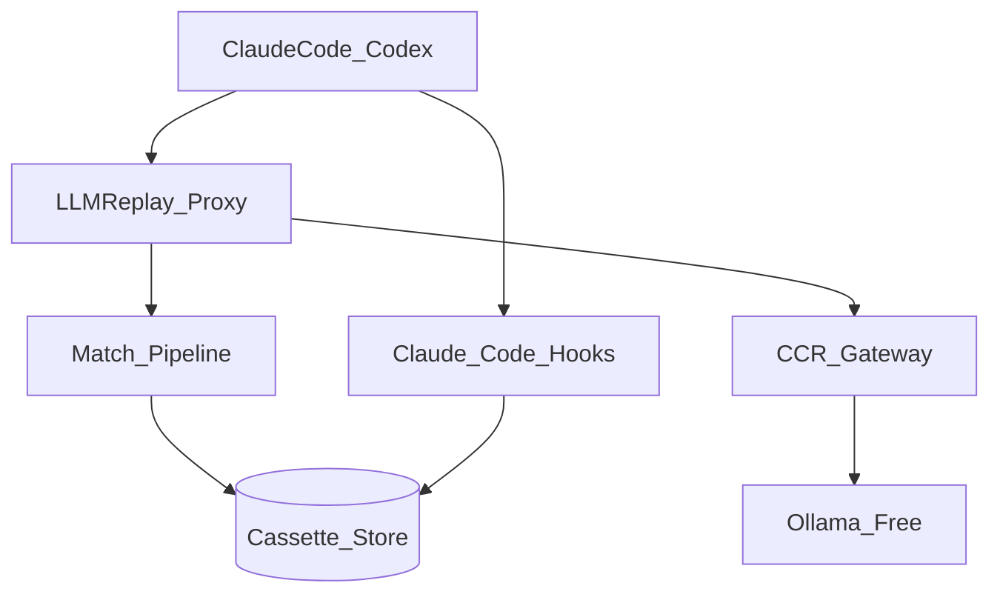
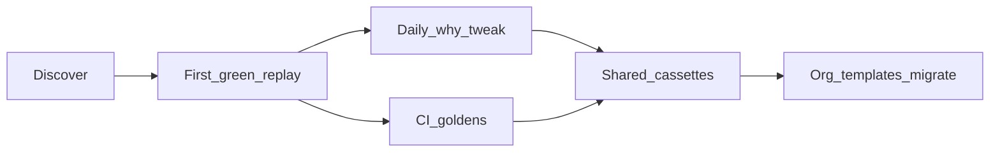

# LLMReplay — Architecture, Design & Usage

VCR / time-travel for coding agents: record Claude Code or Codex once, then replay offline — stop, tweak, fork, and assert — without burning tokens or waiting on nondeterministic model runs.

Normative MUST/MUST NOT rules live in [docs/SPEC.md](docs/SPEC.md). This document is the product architecture, design locks, and how people use the system. Alpha gaps: [docs/alpha-limitations.md](docs/alpha-limitations.md).

---

## Architecture



| Layer | Role |
|---|---|
| **Agents** | Claude Code / Codex pointed at loopback via `ANTHROPIC_BASE_URL` / `OPENAI_BASE_URL` |
| **Proxy** | Allowlisted HTTP (`/v1/messages`, `/v1/chat/completions`, `/v1/responses`, `/v1/models`, `/healthz`) |
| **Match pipeline** | Canonicalize → strip ignore → scrub placeholders → sort tools → SHA-256 static key |
| **Cassette store** | Manifest + request/response blobs + snapshots + hook digests |
| **Free stack** | Free client key → proxy → [CCR](https://github.com/musistudio/claude-code-router) → Ollama |
| **Hooks** | Claude Code Pre/PostToolUse; record/force decisions; `mark-live` bypass |

Agents talk **HTTP loopback** only (`http://127.0.0.1:<port>`). No MITM TLS. Do not expose the proxy off localhost without `--allow-remote` and auth.

### Package map

| Package | Responsibility |
|---|---|
| `llmreplay.core` | Match keys, volatility / field classes, exit codes, JCS |
| `llmreplay.store` | Cassette layout, manifest models |
| `llmreplay.proxy` | ASGI proxy, SSE synthesize, free-key auth, config |
| `llmreplay.scrub` | HMAC scrub + residual detection |
| `llmreplay.config` | `llmreplay.yaml` profiles |
| `llmreplay.cli` | Typer entrypoints |
| `llmreplay.diagnose` | `why`, `doctor`, `validate`, `bundle`, `mark-*` |
| `llmreplay.teststack` | CCR + Ollama + free keys |
| `llmreplay.snapshot` | `tar.zst` workspace snapshots |
| `llmreplay.hooks` | Install / verify / decide |
| `llmreplay.lineage` | Fork / tweak / sticky |
| `llmreplay.session` | Nested parent/child cassette digests |
| `llmreplay.migrate` | Schema upgrades |
| `llmreplay.parity` | Agent protocol goldens |
| `llmreplay.adapters` | ProtocolAdapter registry (Anthropic, OpenAI) |
| `llmreplay.transport` | In-process httpx transports (ReplayTransport, RecordTransport) |
| `llmreplay.pytest_plugin` | pytest plugin (entry point `pytest11`) |
| `plugins/llmreplay` | Claude Code plugin + skills |

---

## Design locks

These are product invariants — changing them requires a SPEC amend in the same PR as code.

### Field classes

| Class | Match | Replay inject | Examples |
|---|---|---|---|
| **static** | Must equal | Recorded literal | model, messages, tool args/results, tool_use IDs |
| **ignore** | Excluded from hash | Recorded literal | usage, latency, request ids |
| **scrub** | Placeholder must equal | `«REDACTED:hmac:…»` | Authorization, API keys |
| **live** | Never from cassette | Real LLM/tool call | `mark-live Bash`, `mark-live __llm__` |
| **template** | Static after materialize | Allowlisted rematerializers | path rebase, uuid |

**Rule:** If a field influences what the agent does next, it is **static**. User “dynamic” means **ignore** (noise) or **live** (must hit the world) — pick one. Never auto-promote a mismatch to ignore.

### Pipeline

1. Optional stream redact at ingress  
2. Canonical JSON (RFC 8785 JCS)  
3. HMAC scrub → placeholders  
4. Path / profile rules  
5. Sort parallel `tool_use` / `tool_result`  
6. Hash static projection → match key  

Thinking/reasoning blocks are stored for forensics but excluded from the hash.

### Profiles

| Profile | Intent |
|---|---|
| `local` | Dev; warn on drift |
| `ci` / `strict` | Fail on residual secrets, sticky writeback forbidden, hermetic replay |
| `debug_sticky` | Opt-in sticky writeback (never in CI) |
| `llm_fixtures_live_tools` | Restore snapshot before each live tool |

Precedence: `CLI flags > env > llmreplay.yaml profile > defaults`.

### Security & trust

- HMAC key: OS keyring or `LLMREPLAY_HMAC_KEY` (never in cassettes/default bundles). Unset → random per-process key; doctor warns.
- Replay binds loopback by default; non-loopback needs `--allow-remote`.
- Free keys (`llmreplay-free-…`) are localhost auth only — never vendor upstream keys.
- Route allowlist; network deny on unmarked replay; scrub before disk and before `bundle`.

### Residual risks (accepted)

- Prompts may remain sensitive unless users scrub/encrypt shared cassettes  
- Exact matching fails on provider serialization drift (prefer miss over wrong hit)  
- Windows atomic directory replace is weaker when files are locked — fail safe  
- Free-stack quality depends on Ollama tool-calling (degraded mode in SPEC)  
- Replay cannot reproduce uncaptured external side effects (MCP remotes, DBs)  

---

## Subsystems

### Proxy

- **Record:** forward to upstream (strip `stream` for capture); scrub; write cassette; synthesize SSE if the client asked for streaming.  
- **Replay:** serve by static hash; synthesize SSE for `stream: true`. Miss → `409 llmreplay_miss`.  
- **`mark-live __llm__`:** always upstream on replay (`--upstream` required); does not write the cassette.  
- Synthetic `/v1/models` when unrecovered in replay.

### Cassettes

On-disk layout (see SPEC S4 / [docs/reference/cassette.md](docs/reference/cassette.md)):

```text
<cassette-root>/
  cassette.json
  requests/<id>.json
  responses/<id>.json
  bodies/<sha256>.bin
  snapshots/<id>.tar.zst
  snapshots/<id>.json
  hooks/decisions.jsonl
  locks/cassette.lock
```

Atomic tmp → fsync → rename; exclusive writer lock. Schema versioned independently of CLI semver (`llmreplay migrate`).

### Matching & diagnosis

- Miss teaching: `llmreplay why --request …` (honors yaml ignore) → suggest `mark-ignore` (never auto-applied).  
- Explicit: `mark-ignore`, `mark-live`, `tweak`, `fork`.  
- Nested sessions: `extensions.session` digests; child mismatch → parent abort (orchestration still depth-first by convention).

### Free test stack

1. `llmreplay test-stack status` healthy (else exit 4)  
2. Mint free key; bind 127.0.0.1  
3. Point agent env at the proxy  
4. Proxy → CCR → Ollama  
5. Cassette records `test_stack` fingerprint  

### Hooks (Claude Code)

- Install helpers + digest pin in cassette  
- Replay forces recorded allow/deny; deny/error puts a stub note in `reason` (+ stderr) — Claude Code has no inject channel for fake tool bodies  
- Digest mismatch → `llmreplay hooks verify --profile ci` (exit 6); not auto at proxy start  
- Tools in `tools.<name>.class: live` return allow on replay when `LLMREPLAY_CONFIG` points at yaml  

### Validation in CI

| Layer | Proof |
|---|---|
| Unit / contract | Match, scrub, proxy, hooks, migrate |
| Integration | Fake upstream; network not required |
| Release smoke | Clean install → offline replay fixture |
| Coverage gate | ≥95% on critical modules (`scripts/mutation_gate.sh`) |

PR CI never needs paid Anthropic/OpenAI APIs.

---

## Usage

### Personas

| Persona | Why they install | Success |
|---|---|---|
| AI app engineer | Agent tests are slow/expensive/flaky | Record once, replay offline while iterating |
| Framework / agent maintainer | Prompt/tool changes break agents | Cassette regression suite |
| Platform / DevEx | Same behavior on laptops + CI | Shared profiles, scrub policy, network-deny CI |
| OSS maintainer | Contributors lack paid API keys | Free stack or committed scrubbed cassettes |
| Reliability engineer | Prod flake not reproducible from logs | Scrubbed capture → first-divergence debug |
| Security-conscious evaluator | Local-first | Scrub, retention, no default telemetry |

**Anti-personas** (use observability/eval tools instead — see [docs/compare-agentreplay.md](docs/compare-agentreplay.md)): live cost dashboards, cross-session memory, desktop-only traces, non-coding chatbots.

### Journeys



1. **First green replay (≤15–20 min):** `doctor` → optional `test-stack up` → wire agent → `record` → offline `replay` → intentional mismatch shows `why`  
2. **Daily debug:** flake → record+snapshot → `why` → `mark-*` / `tweak` / `fork` → re-replay  
3. **CI goldens:** scrubbed cassettes in git → `--profile ci` → fail on static drift / live leak → upload `bundle` on failure  
4. **Prod flake → regression:** scrub export → replay → isolate first divergence → commit minimal cassette  
5. **Solo → team → org:** shared cassettes → org ignore/scrub templates → `migrate` on upgrades  

**Steepest drop-off:** agent traffic never hits the proxy (empty cassettes). Mitigate with `doctor`, integration docs, and `scripts/smoke.sh`.

### Command surfaces

| Command | Role |
|---|---|
| `doctor` | Env checklist; next action on fail |
| `record` / `replay` | Proxy modes; `replay --check` offline health |
| `why` | Static miss teaching |
| `mark-ignore` / `mark-live` | Explicit field/tool class changes |
| `validate` / `bundle` | Cassette health; scrubbed diagnostic zip |
| `migrate` | Schema upgrade |
| `fork` / `tweak` / `sticky` | Lineage and debug writeback |
| `test-stack` / `keys` | Free CCR+Ollama path |
| `hooks install\|verify\|decide` | Claude Code lifecycle |

Exit codes: [docs/reference/exit-codes.md](docs/reference/exit-codes.md). Generated CLI: [docs/reference/cli.md](docs/reference/cli.md).

### Support posture

| | |
|---|---|
| **Channels** | GitHub Discussions (usage), Issues (repro bugs), private SECURITY advisory |
| **Will support** | Documented Claude Code/Codex/CCR/Ollama matrix; scrubbed minimal cassette + `doctor --json`; matcher/migrate/security bugs |
| **Will not** | Arbitrary prompt debugging; model quality; provider outages; raw secrets in public issues; uncaptured side effects |

Telemetry: **off by default**; opt-in only; never prompts/paths/cassette bodies.

### Success criteria

1. Free key + CCR + Ollama: record/replay at $0 cloud LLM cost  
2. Strict unmarked replay: zero upstream calls  
3. Controllable match contract (distinct from observability tools)  
4. Hook script change → exit 6 naming the script  
5. Cassette secret scan clean; HMAC scrub  
6. New user reaches first green offline replay in ≤20 minutes  
7. Common tickets triageable from `doctor --json` + scrubbed `bundle`  

---

## Documentation map

| Doc | Contents |
|---|---|
| [docs/SPEC.md](docs/SPEC.md) | Normative contract (MUST language) |
| [docs/quickstart.md](docs/quickstart.md) | Short path to first replay |
| [docs/concepts/](docs/concepts/) | Field classes, matching, profiles, snapshots, fork/tweak |
| [docs/integrations/](docs/integrations/) | Claude Code, Codex |
| [docs/free-test-stack.md](docs/free-test-stack.md) | CCR + Ollama |
| [docs/ci.md](docs/ci.md) | CI / release / nightly |
| [docs/troubleshooting.md](docs/troubleshooting.md) | Miss / doctor / bundle |
| [docs/threat-model.md](docs/threat-model.md) | Security boundaries |
| [docs/alpha-limitations.md](docs/alpha-limitations.md) | What alpha does not yet claim |
| [docs/dev/coding-standards.md](docs/dev/coding-standards.md) | Contributor / agent coding rules |
| [docs/dev/package-map.md](docs/dev/package-map.md) | Package ownership map |
| [CONTRIBUTING.md](CONTRIBUTING.md) | 30-minute contributor path |
