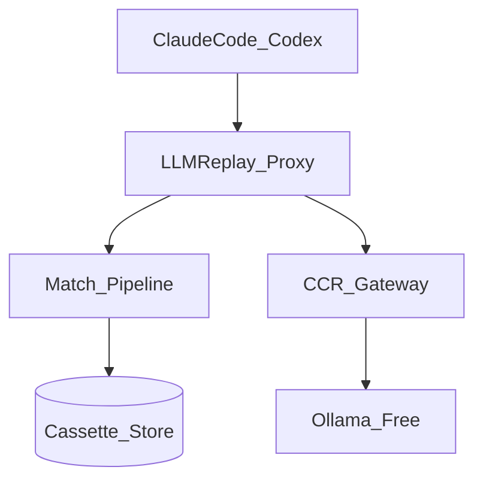
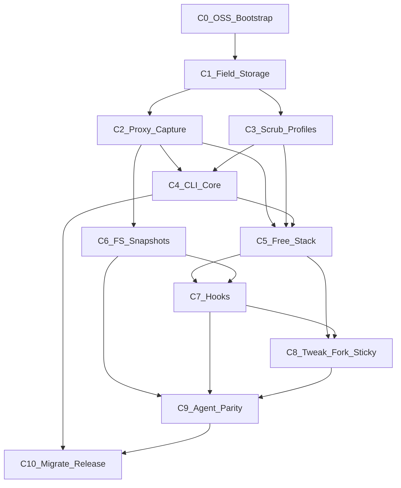
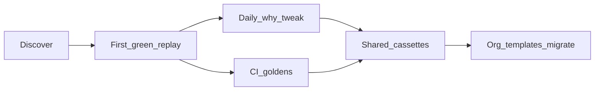

# LLMReplay Design & Progress Tracker

> **Living document.** Architecture is locked at 10/10. Implementation progress is tracked below.
> Source plan history: Cursor plan `llmreplay_dynamic_content_5945cbe8`.

## Implementation progress

| Chunk | Status | Commit | Notes |
|---|---|---|---|
| C0 OSS bootstrap | **done** | `3056aca` | Repo + SPEC + CLI + governance + CI |
| C1 Field + storage | **done** | `6f35e2e` | match/hash + cassette store |
| C2 Proxy capture | **done** | `23da04d` | allowlisted proxy record/replay |
| C3 Scrub + profiles | planned | | |
| C4 CLI core + doctor/bundle | planned | | |
| C5 Free CCR+Ollama stack | planned | | |
| C6 FS snapshots | planned | | |
| C7 Hooks | planned | | |
| C8 Tweak/fork/sticky | planned | | |
| C9 Agent parity | planned | | |
| C10 Migrate + release | planned | | |

**Rule:** Update this table in the same PR that completes a chunk. Every chunk needs tests + **cheap-model** review before push (see [docs/dev/coding-standards.md](docs/dev/coding-standards.md); **no Opus for routine review**).

**Coding:** Pydantic v2 at boundaries; typed APIs; Ruff-clean. Agents must follow coding-standards.md.

---

# LLMReplay — Verified Design, Chunks, Validation, Docs

**Architecture score: 10/10** (council round 5 — locked). Implementation may start only against the Normative SPEC below; inventing unspecified behavior is a bug.

Single shipping product. No v1/v2.

---

## Architecture score lock (council round 5)

| Seat | Model | Agent | Pre-SPEC | Post-SPEC |
|---|---|---|---|---|
| Architecture precision | Claude Opus 4.6 | [Arch](9cb0a35f-09a0-496c-9cff-e943829abdd2) | 6.7/10 | **10/10** with SPEC |
| Systems auditor | GPT 5.6 Terra | [Spec](2c0d6a9f-b1e9-4b43-9d7e-f5eca68d54b6) | 0/10 (no repo SPEC) | **10/10** if adopted |
| Integration contracts | Claude Sonnet 4.6 | [Integr](9590378d-73b3-4c13-81f0-e1c6339cbdb9) | ~1/10 contracts | **10/10** with 8 rules |

**What 10/10 means here:** Two engineers implement the same match keys, cassette bytes, proxy routes, restore semantics, and agent wiring without inventing policy. Not “perfect forever.”

**Residual risks accepted (do not block 10/10):**
- Prompts may remain sensitive unless users scrub/encrypt shared cassettes
- Exact matching fails on provider serialization drift (prefer miss over wrong hit)
- Windows atomic directory replace weaker when files locked — fail safe, no partial overwrite
- Free-stack quality depends on Ollama model tool-calling capability (degraded mode defined)
- Replay cannot reproduce uncaptured external side effects (MCP remotes, DBs) — documented limitation

**Process lock:** Any new behavior requires a SPEC amend in the same PR as code (`docs/SPEC.md` shipped in C0 from this section).

---

## Design locks (unchanged core)

- Field classes: `static` | `ignore` | `scrub` | `live` | `template` (allowlist only)
- Rule: influences next agent action → **static**; user “dynamic” → ignore **or** live
- Pipeline: stream redact → canonical JSON → HMAC scrub → path rules → sort `tool_result` by id → hash static projection
- Profiles: `local`, `ci`, `strict`, `llm_fixtures_live_tools`, `debug_sticky`
- Free testing: LLMReplay free client key → local proxy → [CCR](https://github.com/musistudio/claude-code-router) → Ollama ([ccg-router](https://github.com/XZXY-AI/ccg-router) fallback)
- Agents: Claude Code + Codex via `ANTHROPIC_BASE_URL` / `OPENAI_BASE_URL`
- Tool IDs: wire literals + `tool_id_map` ordinals
- Never auto-promote mismatch → ignore



---

## Normative SPEC (implementation MUST follow)

Ship as `docs/SPEC.md` in C0. Normative language: MUST / MUST NOT / SHOULD.

### S1. Canonicalization and hashing

- MUST canonicalize JSON per **RFC 8785 (JCS)**; Python MUST use a pinned JCS library (document name+version in lockfile).
- MUST encode UTF-8; Unicode NFC for path strings.
- Numbers: JCS rules only (no `1` vs `1.0` divergence).
- **Static projection:** deep-copy event → delete all `ignore` paths → keep `static` and `scrub` (placeholders) → JCS bytes.
- **Match key:** `SHA-256(static_projection_jcs_bytes)` hex lowercase.
- MUST sort `tool_result` / parallel `tool_use` blocks by `(name, JCS(input), tool_use_id)` before projection; store raw order in cassette; strip sort annotations before forwarding to agents.
- Thinking/reasoning content blocks MUST be excluded from the hash; MUST be stored under `thinking_blocks` for forensics; MUST NOT be required for replay match.

### S2. Scrub and stream redact

- MUST redact at stream ingress before any disk/log buffer (anti-TOCTOU).
- Placeholder format: `«REDACTED:hmac:<hex16>»` where hex16 = first 16 hex chars of `HMAC-SHA-256(hmac_key, canonical_secret_utf8)`.
- HMAC key MUST live in OS keyring or `LLMREPLAY_HMAC_KEY`; MUST NOT appear in cassettes, bundles (default), or logs.
- Detection: JSONPath allowlist in `scrub_patterns.yaml` PLUS regex set (JWT, `AKIA`, `ghp_`, `sk-`, PEM, `xox*`); post-scrub residual detector MUST fail record in `strict`/`ci` if secrets remain.
- Auth headers listed as scrub MUST be removed from match projection entirely (not hashed as plaintext).

### S3. Step-level taint (not value-flow)

- Each step has taint `{clean|live|unknown}`.
- A `live` step taints all subsequent steps until a new snapshot restore boundary.
- `strict`/`ci` MUST fail (exit 8 or 1 per profile) if a clean replay step would consume output from a tainted predecessor without explicit `live` chain marking.
- Value-level taint tracking is MUST NOT (intractable).

### S4. Cassette on-disk layout and concurrency

```text
<cassette-root>/
  cassette.json          # manifest + schema_version + checksums
  cassette.json.bak.<n>
  requests/<id>.json
  responses/<id>.json
  bodies/<sha256>.bin
  snapshots/<id>.tar.zst
  snapshots/<id>.json
  locks/cassette.lock
```

- Writers: exclusive lock; write `*.tmp.<pid>.<nonce>` → fsync → atomic rename → replace manifest.
- Readers: shared lock on manifest.
- One logical writer; multi-process record serializes on lock; order = manifest commit order.
- Startup: delete unreferenced `.tmp.*` older than 10m under lock.
- Corrupt manifest → restore newest valid `cassette.json.bak.*` or refuse with exit 5; `llmreplay repair` deletes unreferenced objects only—MUST NOT invent transactions.
- Interrupted streams store `completion_state: aborted` and replay the same abortion.

### S5. Proxy routing table

MUST reject unlisted routes with `404 LLMREPLAY_ROUTE_DENIED`.

| Method | Path | Behavior |
|---|---|---|
| POST | `/v1/messages` | Anthropic Messages (+ SSE) |
| POST | `/v1/chat/completions` | OpenAI Chat (+ SSE) |
| POST | `/v1/responses` | OpenAI Responses (+ SSE) |
| GET | `/v1/models` | Cassette-stored or synthetic catalog; no upstream in replay |
| GET | `/healthz` | Local health; never recorded |

- MUST NOT honor client `Host` for upstream selection; upstream only from static config / CCR.
- Replay mode: MUST NOT perform DNS/outbound sockets (except loopback health).
- `CONNECT`, WebSocket, absolute-form proxy URLs: denied.

### S6. Streaming synthesis

- Record: store final reassembled message + optional `thinking_chunk_boundaries` + raw provider event log (redacted) for `STREAM=exact`.
- Replay default `STREAM=synthesize`: emit valid SSE/event sequence reconstructing the stored final message with **same tool_use IDs and content-block order**; thinking deltas chunked per stored boundaries or 64 chars.
- Anthropic: `message_start` → `content_block_*` → `message_delta` → `message_stop`.
- OpenAI Chat: `chat.completion.chunk` sequence ending with `finish_reason`.
- Responses: `response.output_item.*` / `response.completed` per OpenAI Responses SSE.
- MUST commit cassette turn only after full assistant turn + paired tool outcomes (turn-atomic).

### S7. Snapshots

- Format: `tar.zst` + `snapshot.json` (POSIX `/` paths, NFC, sha256, mode, type, link target).
- Capture: declared workspace roots only; exclude `.git`, caches, sockets, devices, FIFOs, denylist (`.env*`, ssh, aws, credentials).
- Restore: verify target not `/`, `$HOME`, or outside workspace; reject `..`, absolute entries, escape symlinks; stage then atomic replace; Windows rename-with-retry or fail without partial apply.
- Snapshot hash participates in match for tool steps when profile requires it.

### S8. Free-mode startup order (`--free`)

1. `llmreplay test-stack status` MUST be healthy (CCR + Ollama ping) else exit 4.
2. Mint/load free client key (`sk-llmreplay-free-…`); bind 127.0.0.1 only unless `--allow-remote`.
3. Start LLMReplay proxy; set agent env:
   - Claude: `ANTHROPIC_BASE_URL=http://127.0.0.1:<port>`, `ANTHROPIC_API_KEY=<free>`, `ANTHROPIC_AUTH_TOKEN=<free>`
   - Codex: `OPENAI_BASE_URL=http://127.0.0.1:<port>/v1`, `OPENAI_API_KEY=<free>`
4. Proxy chains to CCR (`127.0.0.1:3456` default); CCR → Ollama.
5. Cassette header MUST record `test_stack: {router, ollama_model, digest}`.
6. Free key MUST NEVER be written to cassette or forwarded as upstream vendor key.

### S9. Ollama tool-calling degraded mode

- MUST probe model capabilities before record; if tools unsupported → `tool_calling:false` in header; include in match context.
- SHOULD warn; MUST NOT pretend tools work.
- Replay MUST abort with clear error if cassette `tool_calling` disagrees with current model capabilities.

### S10. Agent feature matrix

| Feature | Claude Code | Codex |
|---|---|---|
| Messages / Chat | `/v1/messages` | `/v1/chat/completions` |
| Responses API | N/A primary | `/v1/responses` when used |
| Parallel tools | yes — sort before hash | yes — sort before hash |
| Thinking/reasoning | store, exclude from hash | store, exclude from hash |
| Nested/subagent | child cassette + `parent_session_id`; parent abort if child miss | same |
| `previous_response_id` | N/A | static when present |

### S11. Nested sessions

- Header: `session_id`, `parent_session_id`, `depth`.
- Parent match key MUST include sorted child cassette hashes.
- Replay children depth-first before parent continuation; child MISS aborts parent.

### S12. Hook protocol (Claude Code)

- Hook stdin: one UTF-8 JSON `{"version":1,"id":"...","event":"PreToolUse|PostToolUse",...}`; stdout: one JSON line decision `allow|deny|error` echoing `id`.
- Max 1 MiB; timeout 5s; fail closed on timeout/invalid.
- Env limited to `LLMREPLAY_*` session vars — MUST NOT expose vendor keys.
- Record `hook_digests` SHA-256 of hook script bytes; `strict`/`ci` exit 6 on digest mismatch.

### S13. Hermetic pins (record+replay when profile `ci`/`strict`)

MUST set: `TZ=UTC`, `LANG=C.UTF-8`, `LC_ALL=C.UTF-8`, `PYTHONHASHSEED=0`.  
SHOULD pin git author/committer to `llmreplay-bot <replay@llmreplay.local>` and fixed date `1970-01-01T00:00:00Z` when tools may create commits.  
Store pin set in cassette header; warn on mismatch.

### S14. Resource limits

| Limit | Value | On breach |
|---|---|---|
| Cassette total size | 512 MB | fail record with exit 7 guidance |
| Single body blob | 32 MB | store truncated marker + hash of full |
| Snapshot total | 256 MB | fail snapshot step |
| Single snapshot file | 16 MB | skip file + note in manifest |
| Hook timeout | 5 s | deny |
| Proxy request timeout | 600 s | error turn |
| Free-key RPM | configurable default 60 | 429 |

MUST NOT silently continue past limit breaches in `strict`/`ci`.

### S15. Profile precedence

`CLI flags > env > llmreplay.yaml profile > defaults`.  
`debug_sticky.writeback` MUST be false in `ci`/`strict` (enforced).  
`llm_fixtures_live_tools` MUST restore snapshot before each live tool.

### S16. Compatibility policy

Independently version: cassette `schema_version` (int), CLI semver, hook protocol, proxy protocol.  
CLI MUST read current and previous two schema majors via `migrate`.  
Unknown agent versions: require `--allow-unknown-agent` and mark cassette `unverified`.  
`doctor` reports all versions; refuse record if hook/proxy protocols incompatible.

### S17. Threat model (C10 doc + C0 stub)

Assets: free keys, HMAC key, prompts, tool I/O, snapshots, cassette integrity.  
Trust boundaries: agent CLI, hooks, LLMReplay proxy, CCR, Ollama/provider, shared cassette storage.  
Threats: secret capture, open-proxy/SSRF, cassette tampering, path traversal, token leakage, malicious hooks, replay escape to upstream.  
Mitigations: localhost bind default, route allowlist, redact-before-disk, network deny in replay, checksums, scrub before bundle, atomic writes.

### S18. Concurrent sessions

Default: one writer per cassette path.  
Parallel agents MUST use distinct cassette roots.  
Same-root contention: lock serializes; MUST NOT interleave turns across sessions in one manifest without `session_id` partitioning (if enabled, match keys include `session_id`).

---

## Gaps closed (round 3–4 additions)

### 1. Error model (stable codes)

| Code | Meaning | User action |
|---|---|---|
| `0` | Success | — |
| `1` | Static mismatch | `why` → `mark-*` / `tweak` / re-record |
| `2` | Cassette/step missing | `record` |
| `3` | Live step / upstream error | Check CCR/Ollama; `test-stack status` |
| `4` | Test-stack unhealthy | `test-stack up` |
| `5` | Schema/migrate required | `migrate` / `repair` |
| `6` | Hook digest / policy divergence | Fix hooks or re-record |
| `7` | Secret/scrub/limit violation | Rotate key; scrub config; reduce size |
| `8` | Network denied in strict/ci | Expected if live attempted |
| `9` | Route denied / protocol violation | Fix base URL / client |

Machine-readable: `.llmreplay/last-failure.json` + stderr footer always prints code name.

### 2. Packaging / runtime

- **Language:** Python 3.12+ (Typer CLI, httpx/uvicorn proxy, pydantic schemas, pytest)
- **Install:** `pip install llmreplay` / `uv tool install llmreplay`
- **Lockfile** for reproducible CI; pin CCR and Ollama model digests in `test_stack` config
- Semver for CLI; separate **cassette `schema_version`** integer with `llmreplay migrate`

### 3. LICENSE + governance (C0)

Apache-2.0, CODE_OF_CONDUCT, CONTRIBUTING, SECURITY, SUPPORT, CHANGELOG, NOTICE (CCR/Ollama attribution).

### 4. TLS strategy

Agents use **HTTP loopback** to LLMReplay (`http://127.0.0.1:<port>`). No MITM TLS required for Claude Code/Codex when base URL is overridden. CCR handles upstream HTTPS to vendors/Ollama. Document: do not expose proxy off localhost without `--allow-remote` + auth.

### 5. Secrets rotation

- HMAC key in OS keyring / `LLMREPLAY_HMAC_KEY` (never in cassette)
- `llmreplay keys rotate-hmac` rewrites placeholders only with migration note (may invalidate match compatibility—documented)
- Free client keys: localhost-bound, quota caps, rotatable via `keys create --free`

### 6. Compatibility matrix

| Dimension | PR CI | Nightly/release |
|---|---|---|
| OS | Linux | Linux, macOS, Windows |
| Python | 3.12, 3.13 | All supported |
| Agent protocols | Fake Claude + Fake Codex fixtures | Fixture version bumps |
| Ollama | Not required for PR | Pinned model digest smoke |
| Network | **Denied** in unit/contract/integration | Free-stack job isolated |

### 7. Cassette schema contract

JSON Schema in `schemas/cassette.vN.json`; header includes `schema_version`, `extensions: {}` (reserved for FS/hooks without breaking changes), `tool_id_map`, `hook_digests`, `test_stack` fingerprint.

---

## Validation framework (merge gate)

**Principle:** Every replay decision is explainable, deterministic, offline. CI never needs paid Anthropic/OpenAI APIs.

### Pyramid

| Layer | Proof |
|---|---|
| Unit | Match dispositions, normalize, scrub, profiles — high branch coverage on matcher/redactor |
| Property/fuzz | Idempotent normalize/redact; secret absence; key determinism; Unicode/nested JSON |
| Contract | Versioned wire fixtures for Anthropic Messages, OpenAI Chat, Responses; cassette schema |
| Integration | Proxy + store + fake upstream + FS snapshotter; network-denied |
| Harness E2E | Fake `claude`/`codex` CLIs emitting protocol transcripts against real LLMReplay CLI |
| Adversarial | Malformed cassettes, path traversal, secret-in-header/body/URL, concurrent writers |
| Mutation | Nightly ≥95% kill rate on matcher/redaction/profile precedence |

### Golden fixtures

`fixtures/cassettes/`, `fixtures/volatility/`, `fixtures/adversarial/`, `fixtures/protocols/{claude,codex}/`

- Fixed test HMAC key (committed test-only)
- `update-goldens` explicit; CI fails on unreviewed fixture drift
- Assert **zero** live network attempts in PR jobs

### Per-chunk acceptance block (required in every PR)

```text
Chunk: C#
Invariants:
Golden fixtures added:
Unit/property tests:
Integration/harness proof:
Adversarial/negative:
Docs/examples updated (doc-with-code):
Network-denied proof:
Pass criteria:
```

Next chunk may not start until prior chunk’s gate is green on `main`.

---

## Documentation (doc-with-code)

**Rule:** PR without mapped docs/examples/fixtures is incomplete.

### Day-0 (C0)

README (working commands), LICENSE, CONTRIBUTING, SECURITY, SUPPORT, CHANGELOG, CODE_OF_CONDUCT, issue/PR templates, `docs/dev/chunk-map.md`, ADR-0001 field-classes, ADR-0002 free-stack, ADR-0003 no-auto-promote.

### User docs (ship with chunks)

| Doc | With chunk |
|---|---|
| `docs/quickstart.md` | C5 |
| `docs/concepts/field-classes.md`, `matching.md` | C1 |
| `docs/concepts/profiles.md` | C4 |
| `docs/free-test-stack.md` | C5 |
| `docs/integrations/claude-code.md` | C7/C9 |
| `docs/integrations/codex.md` | C9 |
| `docs/ci.md` + workflow | C10 (skeleton in C0) |
| `docs/troubleshooting.md` | C4+ (expand each chunk) |
| `docs/reference/cli.md` (generated) | C4+ |
| `docs/reference/llmreplay-yaml.md` | C3 |
| `docs/reference/cassette.md` + `schemas/` | C1/C10 |
| `docs/compare-agentreplay.md` | C0 |

### Artifacts

`examples/claude-code-hello/`, `examples/codex-hello/`, `examples/profiles/*`, `scripts/smoke.sh`, `scripts/dev-setup.sh`

### Contributor 30-min path (CONTRIBUTING)

Clone → `dev-setup` → `test-stack up` → hello example record/replay → break static field → offline pytest → pick chunk from chunk-map.

---

## Implementation chunks (C0–C10)



### C0 — OSS bootstrap (S)

**Scope:** Repo skeleton, Apache-2.0, governance, pyproject, pytest/ruff CI (network-denied), `schemas/` stub, error-code enum, docs stubs, chunk-map, ADRs.

**Depends:** —

**Acceptance:**
- `pip install -e .` works; `llmreplay --help` prints
- CI green on Linux with network denied
- LICENSE + SECURITY + CONTRIBUTING present
- Error codes documented in `docs/reference/exit-codes.md`

### C1 — Field model + storage (S)

**Scope:** Cassette schema with `extensions: {}`, normalize/hash/match dispositions, volatility registry, SQLite/JSONL store, golden + property tests.

**Depends:** C0

**Acceptance:**
- Property: normalize/redact idempotence
- Goldens: exact, ignore-drift, static miss, scrub match
- JSON Schema validates written cassettes
- Docs: field-classes, matching, cassette reference

### C2 — Proxy + live capture (M)

**Scope:** Local HTTP proxy; Anthropic Messages + OpenAI Chat + Responses catch-all (models/health synthetic); fake upstream for tests; write captures to store.

**Depends:** C1

**Acceptance:**
- Contract fixtures for all three API surfaces
- Catch-all preflight returns 200; STRICT mode lists unmapped paths
- Integration: record via proxy against fake upstream, network to WAN denied
- Architecture doc proxy section

### C3 — HMAC scrub + profiles (S)

**Scope:** Stream-layer redact, HMAC scrub, `llmreplay.yaml` load, starter ignore/scrub packs, secret scanner on write.

**Depends:** C1 (parallelizable with C2)

**Acceptance:**
- Adversarial fixtures: secrets in headers/body/URL/tool results never on disk
- Profile precedence tests; yaml reference doc
- CI secret scan on `fixtures/` and sample cassettes

### C4 — CLI core + support surfaces (S)

**Scope:** `record`, `replay`, `why`, `mark-ignore`, `mark-live`, `doctor`, `validate`, `bundle`; profiles `local`/`ci`/`strict`; generated CLI reference; troubleshooting starters.

**Depends:** C1, C2, C3

**Acceptance:**
- Harness: fake agent → record → replay offline exit 0
- Static mismatch → exit 1 + copy-paste mark suggestion + `why`
- `doctor` checks proxy port, agent env, permissions; fails with next action
- `bundle` produces scrubbed, previewable diagnostic zip (no secrets by default)
- `docs gen --check` for CLI md
- First vertical demo on README

### C5 — Free test-stack + keys (M)

**Scope:** `test-stack up/down/status`; CCR config; Ollama pull/pin; `keys create --free`; `--free` env injection for claude/codex; smoke script.

**Depends:** C2, C3, C4

**Acceptance:**
- `scripts/smoke.sh` record+replay with Ollama (scheduled/nightly; optional PR label)
- Free key localhost-only; quota enforced
- `docs/free-test-stack.md` + examples hello (may use fake upstream in PR CI)
- Exit code 4 when stack unhealthy

### C6 — FS snapshots (M)

**Scope:** Snapshot after tool boundaries; restore before live/replay; denylist; snapshot hash in match; `extensions.fs` populated.

**Depends:** C2

**Acceptance:**
- Restore yields identical tracked-file manifest hash
- Denylist excludes `.env`/ssh/aws from blobs
- Adversarial: path traversal rejected
- Snapshot semantics in matching docs

### C7 — Hooks lifecycle (S)

**Scope:** Claude Code Pre/PostToolUse install helpers; record/force allow-deny; `hook_digests`; tool stub on replay.

**Depends:** C2, C5, C6

**Acceptance:**
- Digest mismatch → exit 6 in strict
- Denial path recorded and forced on replay
- `docs/integrations/claude-code.md` hook section

### C8 — Tweak / fork / sticky / templates (M)

**Scope:** `tweak`, `fork` lineage DAG, `debug_sticky` writeback, allowlisted template materializers, invalidate suffix rules.

**Depends:** C5, C7

**Acceptance:**
- Fork at seq N + tweak → new run_id; prefix shared
- Sticky forbidden in `ci`/`strict` profiles (test enforced)
- Template unknown materializer rejected
- CLI + concepts docs updated

### C9 — Claude Code + Codex agent parity (L)

**Scope:** Multi-turn tool_use fidelity; Codex Responses + `previous_response_id`; shared FS; sort tool_results; thinking chunk boundaries; full examples.

**Depends:** C6, C7, C8

**Acceptance:**
- Protocol harness multi-turn Claude + Codex goldens
- `examples/claude-code-hello` + `examples/codex-hello` documented
- Integration docs complete; troubleshooting for ID desync / path pin
- Success criteria: both agents record/replay under free stack (nightly)

### C10 — Migrate + release (S)

**Scope:** `migrate` across schema versions; PyPI release; full OS matrix; mutation suite gate; changelog schema callouts; `docs/ci.md` final.

**Depends:** C4, C9

**Acceptance:**
- Old cassette fixtures migrate then replay
- Release smoke: clean container install → help → offline replay fixture
- Nightly mutation ≥95% on critical modules
- SUPPORT/SECURITY reviewed

---

## Wrong-order risks (council)

1. Shipping CLI export (C4) before HMAC scrub (C3) → secret leaks in shared cassettes
2. Agent integration (C9) before FS snapshots (C6) → false-green multi-turn replays
3. Free stack (C5) before proxy catch-all (C2) → Claude/Codex init failures misdiagnosed
4. Migrate (C10) before schema freeze post-C9 → repeated breaking migrations
5. Sticky enabled in CI profiles → poison cassettes
6. Docs deferred to end → unusable OSS at first public push (block via doc-with-code)

---

## Customer usage (how people use it)

Council round 4 (Customer Success + Product Adoption) — readiness **6/10** until doctor/bundle/compatibility contracts ship with C4/C5/C10.

### Personas

| Persona | Why they install | Success look like |
|---|---|---|
| AI app engineer | Agent tests are slow/expensive/flaky | Record once, replay offline while iterating |
| Framework / agent maintainer | Prompt/tool changes break Claude Code or Codex | Cassette regression suite with schema stability |
| Platform / DevEx engineer | Team needs same agent behavior on laptops + CI | Shared profiles, scrub policy, CI network-deny |
| OSS library maintainer | Contributors lack paid API keys | Clone → free stack or committed scrubbed cassettes |
| Reliability / incident engineer | Prod agent flake not reproducible from logs | Import scrubbed capture → first-divergence debug |
| Security-conscious evaluator | Local-first; no SaaS for prompts/code | Prove scrub, retention, no default telemetry |

**Anti-personas (redirect to AgentReplay / eval tools):** live cost dashboards, cross-session memory, desktop-only observability, non-coding chatbots. README compare table is mandatory (C0).

### Journeys



1. **TTFR (≤15–20 min):** `doctor` → `test-stack up` → free key → wire agent → record → offline `replay` green → intentional mismatch shows `why`
2. **Daily debug:** flake → record+snapshot → `why` → `mark-*` / `tweak` / `fork` → re-replay (no token burn)
3. **CI goldens:** scrubbed cassettes in git → `--profile ci` → fail on static drift / live leak → upload `bundle` on failure
4. **Prod flake → regression:** scrub export → replay pinned agent version → isolate first divergence → commit minimal cassette
5. **Solo → team → org:** shared cassettes → org ignore/scrub templates → `migrate` on upgrades

**Steepest drop-off:** wiring Claude Code/Codex so traffic actually hits the proxy (empty cassettes). Mitigate with `doctor --agent`, plugin/auto-env, and smoke-ttfr.

### What generates support tickets

- Env: wrong base URL, Ollama down, CCR misconfig, OS path/symlink/CRLF, corporate TLS
- Record: incomplete streams, concurrent sessions, process bypassing proxy
- Match: timestamps/IDs, over-broad ignore, ambiguous multi-match, weak miss diffs
- FS: huge snapshots, dirty-tree restore, state outside workspace
- Secrets: raw cassettes committed; scrub changing match keys
- CI: accidental `live`, cassette bloat, machine-specific paths
- Expectations: “fix my prompt,” Ollama quality, provider outages — **out of scope**

---

## Support model

### Community OSS (default)

| | |
|---|---|
| **Channels** | GitHub Discussions (usage), Issues (repro bugs), private SECURITY advisory |
| **SLA** | None; best-effort. Security ack target: 5 business days |
| **Will support** | Latest stable; documented Claude Code/Codex/CCR/Ollama/OS matrix; scrubbed minimal cassette + `doctor --json`; matcher/migrate/security bugs |
| **Will not support** | Arbitrary app/prompt debugging; model quality; provider billing/outages; undocumented forks; raw production secrets in public issues; uncaptured external side effects |

Issue template requires: `llmreplay doctor --json`, versions, profile/mode, OS, scrubbed minimal cassette or `bundle` id, expected vs actual, first `why` output.

### Optional paid (future; not required for OSS launch)

Private triage, CI rollout help, custom scrub review, upgrade planning, training. Buys responsiveness—not gated bugfixes for core reliability. Suggested response targets (not resolution SLAs): 1–2 business days; critical blockers faster under contract. Still excludes 24×7 ops and unrelated app code.

### Support-reducing product surfaces (ship in C4+)

| Command | Role |
|---|---|
| `doctor` / `doctor --agent` | Env + wiring checklist; next action on fail |
| `why` | Static-first miss teaching |
| `validate` | Corrupt cassette, secrets, ambiguous match, stale schema |
| `bundle` | Scrubbed, previewable diagnostic zip; bodies opt-in |
| `migrate --dry-run` | Schema upgrade preview |

Safe defaults: CI network-deny; refuse dirty snapshot restore without flag; atomic cassette writes; scrub before commit/export; `.gitignore` for raw recordings.

**Telemetry:** off by default; opt-in only; never prompts/paths/cassette bodies; show payload before enable. Useful: version/OS family, doctor error codes, miss category, TTFR bucket.

### North-star + support health metrics

> Repositories with deterministic, network-free replay in **both** local and CI over a rolling 30 days.

Also track: TTFR median & %, doctor first-pass %, issues per 100 active repos, % resolved via docs/`why`/`bundle`, upgrade-ticket rate, secret findings blocked pre-export.

### SUPPORT.md commitments (C0)

Document the table above verbatim; link compatibility matrix (C10); state “replay only reproduces what was captured”; point anti-personas to AgentReplay compare page.

---

## Definition of done (open source effective)

- [ ] Outsider completes CONTRIBUTING 30-min path on clean machine
- [ ] TTFR smoke (`scripts/smoke-ttfr`) ≤20 min documented path
- [ ] PR CI hermetic (no paid APIs); nightly free-stack smoke with pinned Ollama
- [ ] All C0–C10 acceptance blocks on `main`
- [ ] `doctor`, `why`, `bundle` usable for issue triage
- [ ] SUPPORT.md boundaries + issue templates live
- [ ] Generated CLI/config docs not stale
- [ ] Apache-2.0 + SECURITY disclosure path live
- [ ] README wedge vs AgentReplay accurate and runnable

---

## Success criteria (product)

1. Free key + CCR + Ollama: Claude Code and Codex record/replay at $0 cloud LLM cost
2. Strict replay: zero upstream calls
3. Timestamp drift warns on `local`; tool-arg drift fails with `why`
4. Hook script change → exit 6 naming script
5. Cassette secret scan clean; HMAC scrub
6. Controllable match contract clearly distinct from observability tools
7. New user reaches first green offline replay in ≤20 minutes (`doctor` → record → replay)
8. Support tickets triageable from `doctor --json` + scrubbed `bundle` alone in the common case
