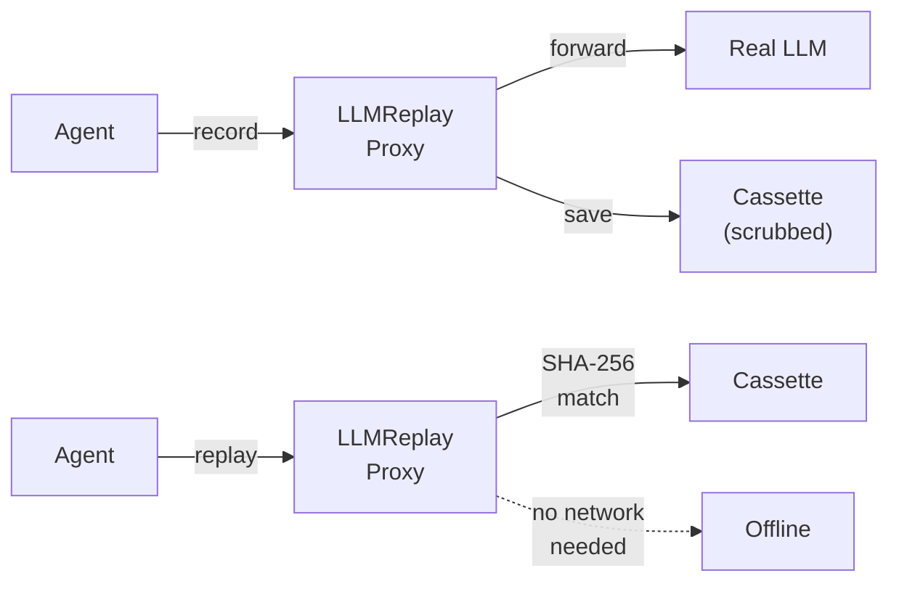
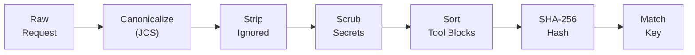

<div align="center">

# LLMReplay

### `VCR for AI coding agents`

**Record once. Replay forever. No tokens burned.**

[](https://github.com/dmallya93/llmreplay/actions/workflows/ci.yml)
[](https://pypi.org/project/coding-agent-vcr/)
[](https://pypi.org/project/coding-agent-vcr/)
[](LICENSE)

</div>

<br>

<div align="center">


</div>

<p align="center">
  <a href="https://raw.githubusercontent.com/dmallya93/llmreplay/main/docs/assets/demo-record-replay.gif">record → replay</a> ·
  <a href="https://raw.githubusercontent.com/dmallya93/llmreplay/main/docs/assets/demo-miss-why.gif">miss → why</a> ·
  <a href="docs/demo.md">5-minute demo script</a>
</p>

> **Status:** Early alpha — [what works and what doesn't](docs/alpha-limitations.md)

---

## The problem

Coding agents (Claude Code, Codex, etc.) are **nondeterministic black boxes**. When they break, you can't reproduce it. When they work, you can't prove it'll work again.

```
                    ┌─────────────────────────┐
  The agent loop:   │  Prompt → LLM → Tools   │──── costs $$$
                    │      ↓          ↓       │──── nondeterministic
                    │  Prompt → LLM → Tools   │──── can't replay
                    │      ↓          ↓       │──── CI needs API keys
                    │  Prompt → LLM → Done    │──── flaky tests
                    └─────────────────────────┘
```

LLMReplay fixes this by recording the LLM traffic once, then replaying it from disk:



---

## Get started in 30 seconds

**One terminal. No CCR. No free keys. No second window.**

```bash
pip install coding-agent-vcr
llmreplay demo
```

`demo` starts a stub gateway + the proxy, records one turn, replays it offline, and prints the commands for a real agent. HMAC is set for you if missing.

> **Note:** CLI / import = `llmreplay`. PyPI name = `coding-agent-vcr`.

---

## Real agent (still one terminal)

`llmreplay run` **is** the gateway — it starts the proxy, runs your agent, then tears down.

```bash
# keep ANTHROPIC_API_KEY in your env (forwarded upstream)
# local HMAC defaults to dev-local-hmac if unset

# Record (proxy = gateway — starts, runs child, tears down)
llmreplay run --mode record --cassette .llmreplay/demo \
  --upstream https://api.anthropic.com \
  -- claude --print "say hi"

# Replay offline
llmreplay run --mode replay --cassette .llmreplay/demo \
  -- claude --print "say hi"

# CI check
llmreplay replay --check --cassette .llmreplay/demo
```

Miss? → `llmreplay why --cassette .llmreplay/demo --request .llmreplay/demo/requests/<tx-id>.json`

Full walkthrough: [docs/quickstart.md](docs/quickstart.md).

---

## How it works

Every field in an LLM request/response is classified into one of four categories:

```
  ┌─────────────────────────────────────────────────────────────────┐
  │                    Field Classification                         │
  │                                                                 │
  │  ┌──────────┐   Must match. Drives agent behavior.             │
  │  │  STATIC  │   model, messages, tools, tool_choice            │
  │  └──────────┘                                                   │
  │  ┌──────────┐   Noise. Stripped before hashing.                 │
  │  │  IGNORE  │   timestamp, request_id, trace_id                │
  │  └──────────┘                                                   │
  │  ┌──────────┐   Secrets → HMAC placeholders before disk.       │
  │  │   SCRUB  │   API keys, tokens, passwords                    │
  │  └──────────┘                                                   │
  │  ┌──────────┐   Always hit the real endpoint for this step.    │
  │  │   LIVE   │   mark-live Bash, mark-live __llm__              │
  │  └──────────┘                                                   │
  └─────────────────────────────────────────────────────────────────┘
```

The match pipeline:



Normative rules: [SPEC.md](docs/SPEC.md) | Architecture: [DESIGN.md](DESIGN.md)

---

## Why LLMReplay

| | Without LLMReplay | With LLMReplay |
|:---|:---|:---|
| **Flaky tool order** | Re-run and hope | Sorted canonically, deterministic match |
| **Prompt regressions** | Unnoticed until prod | Golden cassettes catch diffs in CI |
| **CI needs API keys** | Expensive, slow, brittle | Fully offline replay from fixtures |
| **Can't reproduce bugs** | "Works on my machine" | Fork cassette at turn N, tweak, replay |
| **Test isolation** | Mock everything by hand | Record real traffic, replay hermetically |

> Observability shows *what happened*.<br>
> LLMReplay decides **what must match** and **re-executes** the trajectory.

---

## Integrations

<table>
<tr><th>Platform</th><th>Quick start</th></tr>
<tr>
<td><b>Claude Code</b></td>
<td>

```bash
llmreplay run --mode record -- claude --print "hi"
```

</td>
</tr>
<tr>
<td><b>Codex</b></td>
<td>

```bash
llmreplay run --mode record -- codex --prompt "hi"
```

</td>
</tr>
<tr>
<td><b>pytest</b></td>
<td>

```python
@pytest.mark.llmreplay(cassette=".llmreplay/cassette")
async def test_agent(llmreplay_cassette):
    resp = await llmreplay_cassette.post("/v1/messages", json={...})
```

</td>
</tr>
<tr>
<td><b>GitHub Actions</b></td>
<td>

Copy [`examples/github-actions/llmreplay-replay.yml`](examples/github-actions/llmreplay-replay.yml)

</td>
</tr>
<tr>
<td><b>Any agent</b></td>
<td>

Set `ANTHROPIC_BASE_URL` or `OPENAI_BASE_URL` to the proxy

</td>
</tr>
</table>

---

## Use as a library

```python
from llmreplay import ReplayTransport
import httpx
from pathlib import Path

transport = ReplayTransport(cassette_dir=Path(".llmreplay/cassette"))
async with httpx.AsyncClient(transport=transport, base_url="http://llmreplay") as client:
    resp = await client.post("/v1/messages", json={...})
    assert resp.status_code == 200
```

Full API: [docs/reference/library.md](docs/reference/library.md)

---

## Hermetic smoke test

```bash
git clone https://github.com/dmallya93/llmreplay.git && cd llmreplay
pip install -e ".[dev]"
export LLMREPLAY_HMAC_KEY=dev-local-hmac
./scripts/smoke.sh
# ✓ smoke ok: record→replay (fake upstream)
```

No Ollama, no paid APIs, no network — pure in-process replay.

---

## Learn

| | |
|---|---|
| **Tutorials** | [Start here](docs/tutorials/README.md) — first cassette → miss → CI → pytest → fork |
| **Demo (5 min)** | [Scripted walkthrough](docs/demo.md) for talks / lunch-and-learns |
| **Case studies** | [When it pays off](docs/case-studies.md) — CI cost, pytest mocks, turn-7 bugs |
| **Share / launch** | [Paste-ready Show HN + Awesome PR copy](docs/launch-copy.md) |

---

## Documentation

<table>
<tr>
<td width="180"><b>Getting started</b></td>
<td><a href="docs/quickstart.md">Quickstart</a> · <a href="docs/tutorials/README.md">Tutorials</a> · <a href="docs/demo.md">Demo</a> · <a href="docs/case-studies.md">Case studies</a> · <a href="docs/alpha-limitations.md">Alpha limitations</a></td>
</tr>
<tr>
<td><b>Reference</b></td>
<td><a href="docs/reference/cli.md">CLI</a> · <a href="docs/reference/library.md">Library API</a> · <a href="docs/SPEC.md">SPEC</a></td>
</tr>
<tr>
<td><b>Integrations</b></td>
<td><a href="docs/integrations/claude-code.md">Claude Code</a> · <a href="docs/integrations/codex.md">Codex</a> · <a href="docs/integrations/pytest.md">pytest</a></td>
</tr>
<tr>
<td><b>Operations</b></td>
<td><a href="docs/ci.md">CI</a> · <a href="docs/portable-cassettes.md">Portable cassettes</a> · <a href="docs/troubleshooting.md">Troubleshooting</a></td>
</tr>
<tr>
<td><b>Security</b></td>
<td><a href="docs/threat-model.md">Threat model</a> · <a href="SECURITY.md">SECURITY.md</a></td>
</tr>
<tr>
<td><b>Optional</b></td>
<td><a href="docs/free-test-stack.md">Free test-stack</a> (CCR+Ollama, $0 local LLM)</td>
</tr>
<tr>
<td><b>Contributing</b></td>
<td><a href="CONTRIBUTING.md">CONTRIBUTING.md</a> · <a href="docs/publishing.md">Publishing</a></td>
</tr>
</table>

---

<div align="center">

**Apache-2.0** · [LICENSE](LICENSE)

Made for developers who are tired of "it worked when I ran it"

</div>
