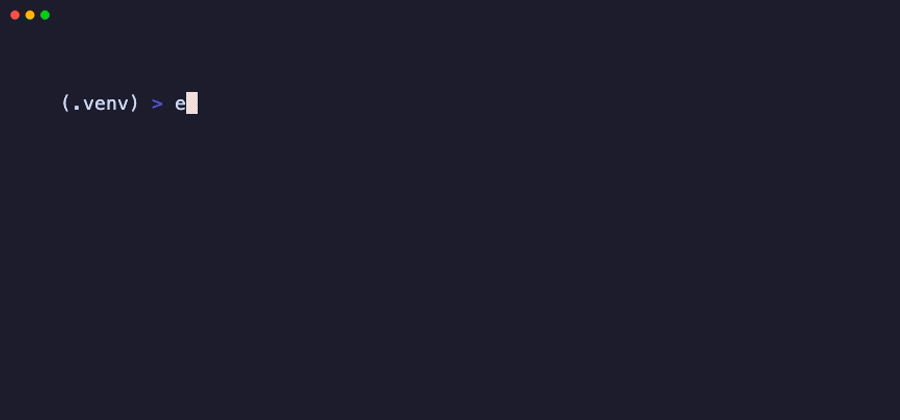
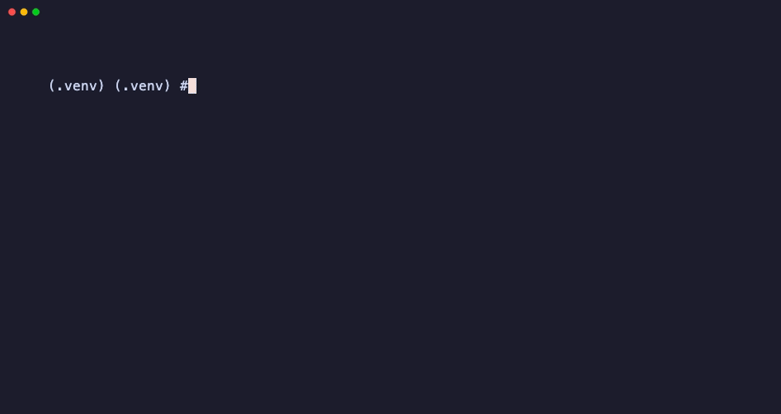
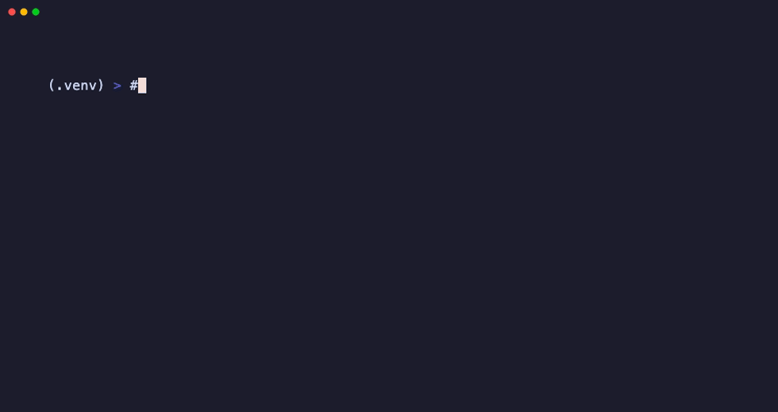

# Demo walkthrough (5 minutes)

Script for a live demo, conference booth, or team lunch-and-learn.
No paid API keys required if you use the hermetic path.

## Pre-recorded GIFs

| GIF | What it shows |
|---|---|
| [demo-hero.gif](assets/demo-hero.gif) | Install hint → `doctor` → hermetic record/replay |
| [demo-record-replay.gif](assets/demo-record-replay.gif) | Focused record → offline match |
| [demo-miss-why.gif](assets/demo-miss-why.gif) | Prompt drift → 409 miss → `why` |

Regenerate (requires [VHS](https://github.com/charmbracelet/vhs)):

```bash
./scripts/render_demos.sh
```



<details><summary>record → replay</summary>



</details>

<details><summary>miss → why</summary>



</details>

```
  ┌────────────────────────────────────────────────────────────┐
  │  DEMO ARC                                                  │
  │                                                            │
  │  1. Pain (30s)                                             │
  │  2. llmreplay demo (60s) — one terminal, no keys           │
  │  3. Record → replay with run (90s)   [optional if agent]   │
  │  4. Force a miss → why (90s)                               │
  │  5. CI punchline (30s)                                     │
  └────────────────────────────────────────────────────────────┘
```

---

## Setup (before you present)

```bash
git clone https://github.com/dmallya93/llmreplay.git
cd llmreplay
pip install -e ".[dev]"
export LLMREPLAY_HMAC_KEY=dev-local-hmac
llmreplay doctor
```

Font size up. Terminal theme high-contrast. Have the README open in a browser tab.

---

## 1. Pain (30 seconds)

**Say:**

> Coding agents are nondeterministic. Unit tests don’t catch flaky tool order.
> CI either burns tokens or skips the agent entirely. Observability shows what
> happened — it doesn’t let you re-run it.

**Show:** The “Why LLMReplay” table on the README.

---

## 2. `llmreplay demo` (60 seconds)

**Run:**

```bash
llmreplay demo
# contributors / CI: ./scripts/smoke.sh
```

**Say:**

> One terminal. No Ollama. No Anthropic key. It starts a stub gateway, records,
> then replays offline. That green line is the whole product loop.

**Expect:** `✓ Done. Start→end in one terminal.`

---

## 3. Optional — real agent with `run` (90 seconds)

Only if Claude Code / Codex is installed and you have an API key:

```bash
llmreplay run --mode record --cassette .llmreplay/demo \
  --upstream https://api.anthropic.com \
  -- claude --print "say hi in one short sentence"

llmreplay run --mode replay --cassette .llmreplay/demo \
  -- claude --print "say hi in one short sentence"
```

**Say:**

> Same shape as `demo`. One command starts the proxy, wires env vars, runs the
> agent, tears down. Second run is offline — same match key, zero tokens.

---

## 4. Force a miss → `why` (90 seconds)

**Run** (change the prompt vs the cassette):

```bash
llmreplay run --mode replay --cassette .llmreplay/demo \
  -- claude --print "say goodbye instead"
```

Then:

```bash
llmreplay why --cassette .llmreplay/demo \
  --request .llmreplay/demo/requests/<tx-id>.json
```

**Say:**

> A miss isn’t a crash — it’s “static fields don’t match.”
> `why` shows the diff so you know if it’s a real prompt regression or noise.

---

## 5. CI punchline (30 seconds)

**Show:** [`examples/github-actions/llmreplay-replay.yml`](../examples/github-actions/llmreplay-replay.yml)

**Say:**

> Drop this into any repo. Secret is the HMAC key, not a provider API key.
> PRs fail when the golden trajectory drifts — not when the model feels spicy.

---

## Slide-free one-liner

> **LLMReplay is VCR for Claude Code and Codex — record once, replay offline, assert in CI.**

Install line for the chat / QR code:

```bash
pip install coding-agent-vcr   # CLI: llmreplay
```

---

## Leave-behinds

| Link | Why |
|---|---|
| [Tutorials](tutorials/README.md) | Self-serve after the talk |
| [Case studies](case-studies.md) | “When would I use this?” |
| [Quickstart](quickstart.md) | Shortest path to green |
| [AGENTS.llmreplay.md](../examples/AGENTS.llmreplay.md) | Paste into consumer repos |

---

## Recording a GIF later

When you capture a terminal GIF for the README hero, follow this same arc
(smoke → miss → why). Motion converts better than static ASCII.
