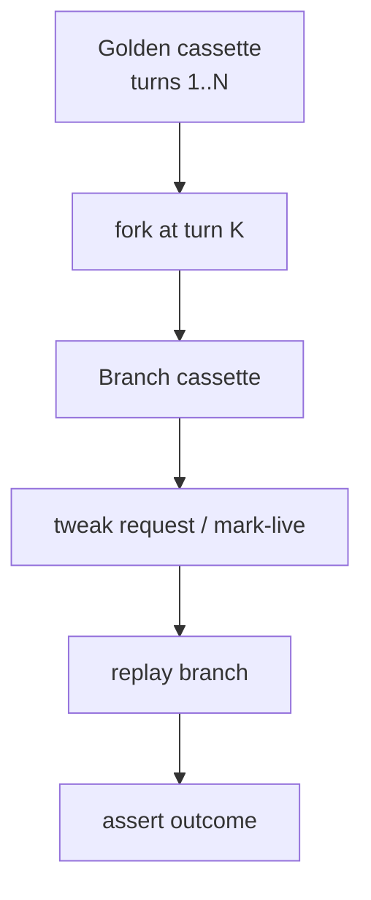

# Tutorial 5 — Fork, tweak, assert

**Goal:** Reproduce a weird agent bug by forking a cassette at turn N, changing one thing, and replaying.

**Prereqs:** Multi-turn cassette (or any cassette you can fork). See also [concepts/fork-tweak.md](../concepts/fork-tweak.md).

---

## The use case

```
  Production: agent fails at turn 7 after a tool call.
  You cannot re-run the live model and hope.

  With LLMReplay:
    1. Cassette has turns 1..N recorded
    2. fork at turn 6
    3. tweak the next user/tool message
    4. replay — assert the new branch
```

This is the “time-travel” part of VCR for agents.

---

## Mental model



---

## Typical commands

Exact subcommands evolve with the CLI — check `llmreplay --help` and [fork-tweak](../concepts/fork-tweak.md). The workflow is always:

```bash
# Inspect
llmreplay replay --check --cassette .llmreplay/demo

# Fork / tweak (see concepts doc for current flags)
# Then:
llmreplay run --mode replay --cassette .llmreplay/demo-fork \
  -- your-agent-command
```

Path placeholders / workspace roots: use
`llmreplay template path_rebase` when moving cassettes across machines
([portable-cassettes.md](../portable-cassettes.md)).

---

## What “helpful” means here

| Debugging style | Outcome |
|---|---|
| Re-run the agent live | Different tools, different text, burned tokens |
| Log dump only | You see history; you cannot re-execute |
| Fork + tweak + replay | Controlled experiment on a frozen trajectory |

---

## Guardrails

- Keep goldens immutable; experiment on forks
- Prefer scrubbed cassettes in git — never commit raw API keys
- Document *why* you forked (bug id / PR link) in the commit message

---

## Next

- [Case studies](../case-studies.md) — real-world shaped narratives
- [Demo walkthrough](../demo.md) — present this live in 5 minutes
